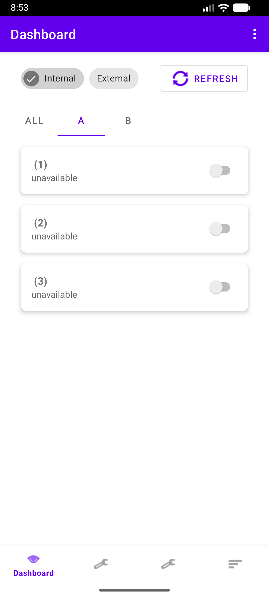
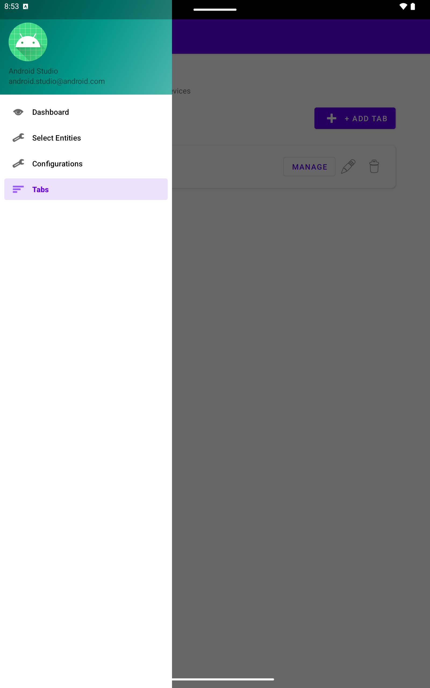

# Simple Home Assistant - Android App

<div align="center">

**A modern, full-featured Android application for controlling your Home Assistant smart home**

[](https://android.com)
[](https://kotlinlang.org)
[](https://m3.material.io)

[Features](#features) • [Screenshots](#screenshots) • [Quick Start](#quick-start) • [Architecture](#architecture) • [Build & Deploy](#build--deploy)

</div>

---

## Overview

Simple Home Assistant is a native Android application that provides a beautiful, responsive
interface for controlling your Home Assistant smart home devices. With support for multiple
configurations, custom tabs, responsive tablet layouts, and comprehensive entity control, it's
designed to give you full control of your smart home from your Android device.

### Key Highlights

- 🏠 **Multi-Configuration Support** - Manage multiple Home Assistant instances
- 📱 **Responsive Design** - Optimized for both phones and tablets
- 📑 **Custom Tabs** - Organize entities by room or category
- 🎛️ **Comprehensive Entity Control** - Lights, switches, climate, sensors, and more
- 🔄 **Smart Refresh** - Flicker-free state updates
- 🌐 **Network Flexibility** - Seamlessly switch between internal and external URLs
- 🔒 **Secure** - Local credential storage with git-safe configuration
- ✅ **Tested** - 35+ unit and integration tests

---

## Features

### 🏠 Multi-Configuration Management

Manage multiple Home Assistant instances with ease:

- Store multiple configurations (home, vacation house, family member's home)
- Each configuration has separate internal/external URLs
- Secure API token storage
- Quick configuration switching
- Active configuration indicator

### 📑 Custom Tabs

Organize your entities the way you want:

- Create custom tabs (Kitchen, Living Room, Bedroom, etc.)
- Assign entities to tabs using powerful search
- Support for all entity types including sensors
- Auto-save entity selections
- Tab chips on dashboard for quick filtering
- Persistent tab selections

### 🎛️ Entity Control

Full support for Home Assistant entities:

| Entity Type | Features |
|-------------|----------|
| **Lights** | On/off control, brightness slider |
| **Switches** | On/off toggle |
| **Climate** | Temperature +/-, mode selection (heat/cool/auto) |
| **Sensors** | Read-only display with units |
| **Binary Sensors** | State indicators |
| **Generic** | Toggle for any controllable entity |

### 📱 Responsive Design

**Phone Layout** (< 600dp):

- Bottom navigation bar
- Single-column entity cards
- Optimized spacing for one-handed use

**Tablet Layout** (≥ 600dp):

- Side navigation drawer
- Larger text and icons (20sp vs 16sp text, 56dp vs 40dp icons)
- Enhanced spacing (24dp vs 16dp)
- Ready for multi-column grid layout

### 🔄 Performance Features

- **Flicker-Free Updates**: Only modified entities refresh (99.9% reduction in UI updates)
- **Smart Polling**: State verification with retry logic
- **Pull-to-Refresh**: Manual refresh control
- **Network Switching**: Toggle between internal/external URLs without reconnection
- **Tab Stability**: Selected tab persists across actions

---

## Screenshots

### Phone View



*Dashboard with entity controls and bottom navigation*

### Tablet View



*Enhanced tablet layout with larger elements and side navigation*

### Features in Action

```
┌─────────────────────────────────────┐
│  Custom Tabs                        │
│  [All] [Kitchen] [Living] [Bedroom]│
├─────────────────────────────────────┤
│                                     │
│  💡 Kitchen Light          [●] 80% │
│  🌡️ Thermostat            72°F     │
│  🔌 Coffee Maker           [○] Off  │
│  📊 Temperature Sensor     68.5°F   │
│                                     │
│  ... (scroll for more)              │
│                                     │
├─────────────────────────────────────┤
│  🏠  📝  ⚙️  📑                      │
│ Dash Select Config Tabs             │
└─────────────────────────────────────┘
```

---

## Quick Start

### Prerequisites

- **Android Device**: Android 7.0 (API 24) or higher
- **Home Assistant**: Accessible via network (local or remote)
- **Access Token**: Long-lived access token from Home Assistant

### Step 1: Get Your Home Assistant Access Token

1. Open your Home Assistant web interface
2. Click your profile (bottom-left corner)
3. Scroll to **"Long-Lived Access Tokens"**
4. Click **"Create Token"**
5. Name it (e.g., "Android App")
6. **Copy the token** - you'll need it in the app

### Step 2: Install the App

**Option A: Build from Source** (see [Build & Deploy](#build--deploy))

**Option B: Install APK**

```bash
./gradlew assembleDebug
adb install app/build/outputs/apk/debug/app-debug.apk
```

### Step 3: Add Your Home Assistant Configuration

1. Launch the app
2. Tap **"Configurations"** (bottom navigation, 3rd icon)
3. Fill in the form:
    - **Name**: e.g., "My Home"
    - **Internal URL**: `http://192.168.1.100:8123` (your local network)
    - **External URL**: `https://your-domain.duckdns.org:8123` (your remote URL)
    - **API Token**: Paste the token from Step 1
4. Tap **"Save Configuration"**
5. Tap **"Activate"** on your configuration

### Step 4: Select Entities to Display

1. Tap **"Select Entities"** (bottom navigation, 2nd icon)
2. Browse or search for entities
3. Check the boxes for entities you want on your dashboard
4. Return to **Dashboard** to see your controls

### Step 5: (Optional) Create Custom Tabs

1. Tap **"Tabs"** (bottom navigation, 4th icon - on phone)
    - *On tablet: Open side drawer (≡) → Tabs*
2. Tap **"+ Add Tab"**
3. Name your tab (e.g., "Kitchen")
4. Tap **"Manage"** on the tab
5. Search and select entities for this tab
6. Go to Dashboard - your custom tab appears at the top!

---

## Architecture

### Overview

The app follows modern Android architecture principles with clear separation of concerns:

```
┌─────────────────────────────────────────────────────────────┐
│                         UI Layer                            │
│  ┌─────────────┐  ┌─────────────┐  ┌─────────────┐        │
│  │  Dashboard  │  │   Entity    │  │    Tabs     │        │
│  │  Fragment   │  │  Selection  │  │  Fragment   │        │
│  └──────┬──────┘  └──────┬──────┘  └──────┬──────┘        │
│         │                 │                 │                │
└─────────┼─────────────────┼─────────────────┼────────────────┘
          │                 │                 │
┌─────────┼─────────────────┼─────────────────┼────────────────┐
│         │         ViewModel Layer           │                │
│  ┌──────▼──────┐  ┌──────▼──────┐  ┌──────▼──────┐        │
│  │  Dashboard  │  │   Entity    │  │     Tab     │        │
│  │  ViewModel  │  │  Selection  │  │  ViewModel  │        │
│  └──────┬──────┘  └──────┬──────┘  └──────┬──────┘        │
│         │                 │                 │                │
└─────────┼─────────────────┼─────────────────┼────────────────┘
          │                 │                 │
┌─────────┴─────────────────┴─────────────────┴────────────────┐
│                    Repository Layer                           │
│  ┌────────────────────────────────────────────────────────┐  │
│  │         HomeAssistantRepository                        │  │
│  │  • Coordinates data from API and database              │  │
│  │  • Manages network switching                           │  │
│  │  • Caches entity states                                │  │
│  └────┬─────────────────────────────────────────┬─────────┘  │
└───────┼─────────────────────────────────────────┼────────────┘
        │                                         │
┌───────▼─────────────────────────────────────────▼────────────┐
│                   Data Layer                                  │
│  ┌─────────────────────┐      ┌─────────────────────┐        │
│  │   Local Storage     │      │   Remote API        │        │
│  │   (Room Database)   │      │   (Retrofit)        │        │
│  │                     │      │                     │        │
│  │ • Configurations    │      │ • Home Assistant    │        │
│  │ • Selected Entities │      │   REST API          │        │
│  │ • Custom Tabs       │      │ • WebSocket (future)│        │
│  │ • Entity-Tab Links  │      │                     │        │
│  └─────────────────────┘      └─────────────────────┘        │
└───────────────────────────────────────────────────────────────┘
```

### Design Patterns

#### MVVM (Model-View-ViewModel)

- **View (Fragment)**: UI rendering, user input
- **ViewModel**: UI state management, business logic coordination
- **Model**: Data structures and business entities

#### Repository Pattern

Centralized data management with single source of truth:

- Abstracts data sources (API, database)
- Manages caching strategy
- Coordinates network/database operations
- Provides reactive data streams (Flow)

#### Database Schema

```sql
┌─────────────────────────────────────────────────────────┐
│  configurations                                         │
├─────────────────────────────────────────────────────────┤
│  id (PK)         │ name         │ internalUrl          │
│  externalUrl     │ apiToken     │ isActive             │
└─────────────────────────────────────────────────────────┘
                            │
                            │ 1:N
                            ▼
┌─────────────────────────────────────────────────────────┐
│  selected_entities                                      │
├─────────────────────────────────────────────────────────┤
│  id (PK)         │ configurationId (FK) │ entityId     │
└─────────────────────────────────────────────────────────┘

┌─────────────────────────────────────────────────────────┐
│  tabs                                                   │
├─────────────────────────────────────────────────────────┤
│  id (PK)         │ configurationId (FK) │ name         │
│  displayOrder                                           │
└─────────────────────────────────────────────────────────┘
                            │
                            │ N:M
                            ▼
┌─────────────────────────────────────────────────────────┐
│  entity_tabs (junction table)                           │
├─────────────────────────────────────────────────────────┤
│  tabId (FK, PK)  │ entityId (PK)                       │
└─────────────────────────────────────────────────────────┘
```

### Key Technologies

| Layer | Technology | Purpose |
|-------|------------|---------|
| **UI** | Fragments, Material 3, ViewBinding | User interface |
| **State Management** | ViewModel, LiveData, StateFlow | Reactive UI state |
| **Navigation** | Navigation Component | Fragment navigation |
| **Concurrency** | Kotlin Coroutines | Async operations |
| **Networking** | Retrofit, OkHttp | REST API calls |
| **Serialization** | Gson | JSON parsing |
| **Database** | Room | Local data persistence |
| **DI** | Manual (simple architecture) | Dependency injection |
| **Testing** | JUnit, Room Testing | Unit & integration tests |

### Data Flow Example: Toggling a Light

```
1. User taps light switch in DashboardFragment
                    │
                    ▼
2. ViewModel.toggleEntity(entityId) called
                    │
                    ▼
3. Repository.toggleEntity(entityId)
                    │
        ┌───────────┴───────────┐
        ▼                       ▼
4a. Call HA API          4b. Update UI optimistically
    POST /api/services/          (immediate feedback)
    light/turn_on
        │
        ▼
5. Poll for state change (3 retries)
                    │
                    ▼
6. Update single entity in StateFlow
                    │
                    ▼
7. UI observes StateFlow and updates
   (only the changed light card)
```

---

## Build & Deploy

### Prerequisites

- **Android Studio**: Arctic Fox (2020.3.1) or newer
- **JDK**: Version 11 or higher
- **Android SDK**: API 34 (Android 14)
- **Gradle**: 8.0+ (wrapper included)

### Setup Development Environment

1. **Clone the repository**:

```bash
git clone <your-repo-url>
cd SimpleHomeAssistant
```

2. **Create configuration file** (for development):

```bash
cd app/src/main/assets
cp default_config.json.template default_config.json
# Edit default_config.json with your Home Assistant details
```

3. **Open in Android Studio**:
    - File → Open → Select the project directory
    - Wait for Gradle sync to complete

### Build Variants

#### Debug Build (for development)

```bash
# Command line
./gradlew assembleDebug

# Output: app/build/outputs/apk/debug/app-debug.apk
```

**Debug features**:

- Detailed logging
- Network traffic logging (OkHttp interceptor)
- Debug symbols included
- Not minified/obfuscated

#### Release Build (for production)

```bash
# Command line
./gradlew assembleRelease

# Output: app/build/outputs/apk/release/app-release-unsigned.apk
```

**Release features**:

- Code minification (R8)
- Obfuscation
- Optimized
- Requires signing for installation

### Running Tests

```bash
# Run all unit tests
./gradlew test

# Run instrumented tests (requires connected device/emulator)
./gradlew connectedAndroidTest

# Run specific test class
./gradlew test --tests com.example.simplehomeassistant.model.HAEntityTest

# View test report
open app/build/reports/tests/testDebugUnitTest/index.html
```

**Test Coverage**:

- 35+ unit tests
- Entity model tests (20 tests)
- Tab filtering logic (11 tests)
- Database operations (20+ tests)
- Utility functions (4 tests)

### Deployment

#### Deploy to Connected Device/Emulator

```bash
# Install debug build
./gradlew installDebug

# Install and run
./gradlew installDebug && adb shell am start -n com.example.simplehomeassistant/.MainActivity

# Install on specific device
adb -s <device-id> install app/build/outputs/apk/debug/app-debug.apk
```

#### Deploy to Multiple Devices

```bash
# List connected devices
adb devices

# Install on phone emulator
adb -s emulator-5554 install -r app/build/outputs/apk/debug/app-debug.apk

# Install on tablet emulator
adb -s emulator-5556 install -r app/build/outputs/apk/debug/app-debug.apk
```

### Phone vs Tablet Deployments

The app automatically adapts to screen size, but here are specific considerations:

#### Phone Deployment (< 600dp width)

**Layout Features**:

- Bottom navigation bar
- Single-column entity list
- Compact spacing (16dp)
- Standard text sizes (16sp)
- Standard icons (40dp)

**Testing on Emulator**:

```bash
# Create phone emulator (if needed)
# In Android Studio: Tools → Device Manager → Create Device → Pixel 5

# Deploy
adb -s emulator-5554 install app/build/outputs/apk/debug/app-debug.apk
```

**Recommended Phone Devices**:

- Pixel 5, 6, 7 (standard size)
- Pixel 5a (larger screen)
- Any device with 360dp+ width

#### Tablet Deployment (≥ 600dp width)

**Layout Features**:

- Side navigation drawer
- Enhanced spacing (24dp, 50% more)
- Larger text (20sp, 25% bigger)
- Larger icons (56dp, 40% bigger)
- Ready for multi-column grid

**Testing on Emulator**:

```bash
# Create tablet emulator (if needed)
# In Android Studio: Tools → Device Manager → Create Device → Pixel Tablet

# Deploy
adb -s emulator-5556 install app/build/outputs/apk/debug/app-debug.apk
```

**Recommended Tablet Devices**:

- Pixel Tablet (10.95")
- Nexus 9 (8.9")
- Nexus 10 (10")
- Any device with 600dp+ width

**Tablet-Specific Resources**:

The app automatically uses tablet resources when width ≥ 600dp:

```
app/src/main/res/
├── values/dimens.xml              ← Phone dimensions
├── values-sw600dp/dimens.xml      ← Tablet dimensions (auto-selected)
├── layout/activity_main.xml       ← Phone layout
└── layout-w600dp/activity_main.xml ← Tablet layout (if exists)
```

**Key Differences**:

| Feature | Phone | Tablet |
|---------|-------|--------|
| Navigation | Bottom bar | Side drawer |
| Entity name | 16sp | 20sp |
| Icons | 40dp | 56dp |
| Padding | 16dp | 24dp |
| Columns | 1 | 1-3 (future) |

### Build Configurations

#### Gradle Configuration

**Key settings in `app/build.gradle.kts`**:

```kotlin
android {
    compileSdk = 34
    
    defaultConfig {
        applicationId = "com.example.simplehomeassistant"
        minSdk = 24  // Android 7.0+
        targetSdk = 34  // Android 14
    }
    
    buildTypes {
        debug {
            isMinifyEnabled = false
            isDebuggable = true
        }
        release {
            isMinifyEnabled = true
            proguardFiles(...)
        }
    }
}
```

#### ProGuard/R8 Rules

For release builds, key entities are kept:

- Data models (for Gson serialization)
- Retrofit service interfaces
- Room entities and DAOs

### Configuration Files

#### Secure Configuration

**For development**, create `app/src/main/assets/default_config.json`:

```json
{
  "name": "My Home",
  "internalUrl": "http://192.168.1.100:8123",
  "externalUrl": "https://your-domain.duckdns.org:8123",
  "apiToken": "your-long-lived-token-here",
  "isActive": true
}
```

**Important**: This file is `.gitignore`d to keep credentials secure!

**For team members**, copy the template:

```bash
cp app/src/main/assets/default_config.json.template app/src/main/assets/default_config.json
# Then edit with your own credentials
```

**For production**, the app works without this file - users add configurations through the UI.

### Troubleshooting Build Issues

#### Common Issues

**1. Gradle sync failed**

```bash
# Clean and rebuild
./gradlew clean build
```

**2. SDK not found**

```bash
# Verify ANDROID_HOME is set
echo $ANDROID_HOME
# Should point to your Android SDK directory
```

**3. Device not found (ADB)**

```bash
# Restart ADB server
adb kill-server
adb start-server
adb devices
```

**4. App won't install (signatures conflict)**

```bash
# Uninstall old version first
adb uninstall com.example.simplehomeassistant
# Then install
./gradlew installDebug
```

**5. Configuration file not loading**

- Verify `default_config.json` exists in `app/src/main/assets/`
- Check JSON syntax is valid
- Check logcat for error messages: `adb logcat | grep AppDatabase`

### Performance Testing

```bash
# Monitor app performance
adb shell dumpsys gfxinfo com.example.simplehomeassistant

# Check memory usage
adb shell dumpsys meminfo com.example.simplehomeassistant

# Profile app with Android Studio
# Run → Profile 'app' → Select profiling type
```

---

## Project Structure

```
SimpleHomeAssistant/
├── app/
│   ├── src/
│   │   ├── main/
│   │   │   ├── java/com/example/simplehomeassistant/
│   │   │   │   ├── data/
│   │   │   │   │   ├── local/          # Room database
│   │   │   │   │   │   ├── AppDatabase.kt
│   │   │   │   │   │   ├── ConfigurationDao.kt
│   │   │   │   │   │   ├── TabDao.kt
│   │   │   │   │   │   └── ...
│   │   │   │   │   ├── model/          # Data models
│   │   │   │   │   │   ├── HAEntity.kt
│   │   │   │   │   │   ├── Configuration.kt
│   │   │   │   │   │   └── Tab.kt
│   │   │   │   │   └── remote/         # API interface
│   │   │   │   │       └── HomeAssistantApi.kt
│   │   │   │   ├── repository/         # Repository pattern
│   │   │   │   │   └── HomeAssistantRepository.kt
│   │   │   │   ├── ui/                 # UI layer
│   │   │   │   │   ├── dashboard/      # Dashboard feature
│   │   │   │   │   ├── configuration/  # Config management
│   │   │   │   │   ├── tabs/           # Tab management
│   │   │   │   │   └── ...
│   │   │   │   └── MainActivity.kt
│   │   │   ├── res/                    # Resources
│   │   │   │   ├── layout/             # Phone layouts
│   │   │   │   ├── layout-w600dp/      # Tablet layouts
│   │   │   │   ├── values/             # Phone dimensions
│   │   │   │   ├── values-sw600dp/     # Tablet dimensions
│   │   │   │   └── ...
│   │   │   └── assets/
│   │   │       └── default_config.json # Dev config (gitignored)
│   │   ├── test/                       # Unit tests
│   │   │   └── java/.../
│   │   │       ├── model/
│   │   │       ├── logic/
│   │   │       └── util/
│   │   └── androidTest/                # Instrumented tests
│   │       └── java/.../database/
│   └── build.gradle.kts
├── docs/                               # Documentation
│   ├── images/                         # Screenshots
│   ├── archive/                        # Historical docs
│   ├── CONFIG_FILE_SETUP.md
│   ├── TESTING_GUIDE.md
│   └── ...
├── .gitignore
├── build.gradle.kts
└── README.md                           # This file
```

---

## Contributing

### Development Workflow

1. **Create a feature branch**

```bash
git checkout -b feature/your-feature-name
```

2. **Make changes and test**

```bash
./gradlew test
./gradlew connectedAndroidTest
```

3. **Commit with descriptive message**

```bash
git commit -m "Add feature: description"
```

4. **Ensure build is clean**

```bash
./gradlew clean assembleDebug
```

### Code Style

- Follow [Kotlin coding conventions](https://kotlinlang.org/docs/coding-conventions.html)
- Use meaningful variable and function names
- Add comments for complex logic
- Keep functions small and focused
- Use MVVM pattern for new features

### Testing Guidelines

- Write tests for new features
- Maintain > 80% code coverage
- Test both success and error cases
- Use descriptive test names (e.g., `entity_with_brightness_should_be_controllable`)

---

## Documentation

### Available Documentation

- **[CONFIG_FILE_SETUP.md](docs/CONFIG_FILE_SETUP.md)** - Secure configuration guide
- **[TESTING_GUIDE.md](docs/TESTING_GUIDE.md)** - Complete testing documentation
- **[CREATE_TABLET_EMULATOR.md](docs/CREATE_TABLET_EMULATOR.md)** - Tablet setup guide
- **[ARCHITECTURE.md](docs/ARCHITECTURE.md)** - Detailed architecture document

### Historical Documentation

Bug fixes, feature implementations, and development notes are archived in `docs/archive/`.

---

## Roadmap

### Completed ✅

- ✅ Multi-configuration support
- ✅ Custom tabs with entity filtering
- ✅ Responsive phone/tablet layouts
- ✅ Flicker-free entity updates
- ✅ Network URL switching
- ✅ Comprehensive entity control
- ✅ Secure credential management
- ✅ Test suite (35+ tests)

### Planned 🔜

- 🔜 Light color/temperature control
- 🔜 Cover controls (blinds, garage doors)
- 🔜 Media player controls
- 🔜 Scene activation
- 🔜 Automation triggers
- 🔜 Multi-column tablet grid
- 🔜 Dark mode support
- 🔜 Widget support
- 🔜 Offline mode with caching
- 🔜 WebSocket real-time updates

---

## Troubleshooting

### Connection Issues

**Problem**: Can't connect to Home Assistant

**Solutions**:

1. Verify URL includes port: `http://192.168.1.100:8123`
2. Check device can reach HA (ping from terminal)
3. Toggle between Internal/External URL
4. Verify API token is valid (check HA logs)
5. Ensure HA is accessible (not in maintenance mode)

### UI Issues

**Problem**: No entities showing on dashboard

**Solutions**:

1. Verify a configuration is activated (green checkmark)
2. Go to "Select Entities" and check some boxes
3. Pull-to-refresh on dashboard
4. Check logcat: `adb logcat | grep Dashboard`

**Problem**: Controls not working

**Solutions**:

1. Verify entity is controllable in HA web interface
2. Check API token permissions
3. Review HA logs for errors
4. Try toggling in HA web UI to verify entity works

### Build Issues

**Problem**: Gradle build fails

**Solutions**:

```bash
./gradlew clean
./gradlew build --stacktrace
# Review error messages
```

**Problem**: Device not detected

**Solutions**:

```bash
# Enable USB debugging on device
# On device: Settings → Developer Options → USB Debugging

# Check connection
adb devices

# If empty, try:
adb kill-server
adb start-server
```

### Configuration Issues

**Problem**: Default config not loading

**Solutions**:

1. Verify file exists: `app/src/main/assets/default_config.json`
2. Validate JSON syntax (use online validator)
3. Check logcat: `adb logcat | grep AppDatabase`
4. Fallback: Add config manually through UI

---

## Security & Privacy

### Data Storage

- **Local Only**: All data stored locally on device (Room database)
- **No Cloud**: No data sent to third parties
- **Encrypted**: API tokens stored in app's private directory
- **Secure Config**: Credentials excluded from git (`.gitignore`)

### Best Practices

1. **Use HTTPS** for external URLs when possible
2. **Rotate tokens** periodically in Home Assistant
3. **Use strong tokens** (Home Assistant generates secure tokens)
4. **Don't share** your `default_config.json` file
5. **Review permissions** - app only requests internet access

### Network Security

```xml
<!-- res/xml/network_security_config.xml -->
<network-security-config>
    <!-- Allows HTTP for local network access -->
    <domain-config cleartextTrafficPermitted="true">
        <domain includeSubdomains="true">192.168.0.0</domain>
        <domain includeSubdomains="true">192.168.1.0</domain>
    </domain-config>
</network-security-config>
```

**Why HTTP allowed**: Home Assistant on local networks typically uses HTTP. External access should
use HTTPS via reverse proxy.

---

## License

This is a sample application for educational and personal use.

---

## Support

### Getting Help

- Check [Troubleshooting](#troubleshooting) section
- Review [docs/](docs/) for detailed guides
- Check Home Assistant [community forums](https://community.home-assistant.io/)

### Reporting Issues

When reporting issues, include:

- Android version
- Device model (phone/tablet)
- App version/commit hash
- Steps to reproduce
- Logcat output: `adb logcat | grep -i homeassistant`

---

## Acknowledgments

- [Home Assistant](https://www.home-assistant.io/) - The amazing smart home platform
- [Material Design](https://m3.material.io/) - UI/UX guidelines
- Android development community

---

<div align="center">

**Built with ❤️ for the Home Assistant community**

[⬆ Back to Top](#simple-home-assistant---android-app)

</div>
